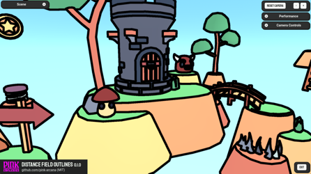
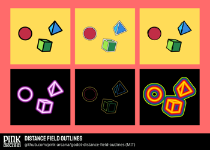
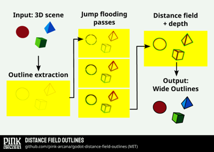
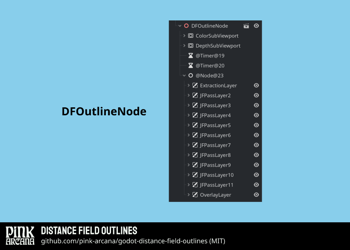
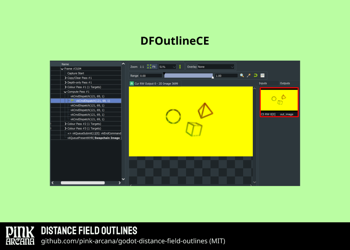
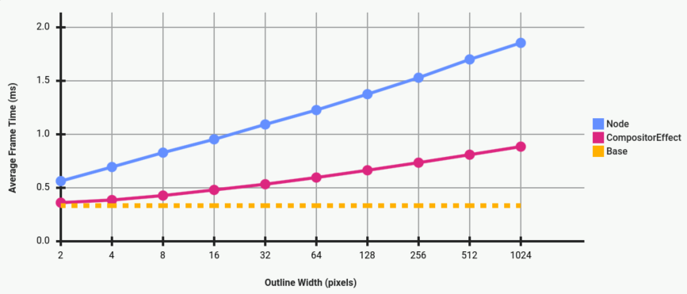

### Distance Field Outlines

This Godot 4 demo project uses **distance fields** to create **wide and performant post-process outlines**. It contains two separate implementations of the same algorithm: **a Node for Compatibility mode**, and **a CompositorEffect for Godot 4.3/Forward+**. They are MIT-licensed and available for anyone to use in their own project.

This is both a demo of distance field outlines, and a template for using them in your own project. Real-time distance fields in post-processing have a lot of use cases -- not just outlines -- and Godot 4.3's new CompositorEffect makes them *very* performant. With more examples of working implementations, I think many other Godot devs might find them as useful in their projects as I have.

I intended this project to address the biggest blockers for most of us. Things like: how to get started with a CompositorEffect, how to set up multi-pass jump flooding, how to access a depth buffer when it doesn't exist...

For other things, like techniques for finding good screen-space outlines, or anti-aliasing, I included basic implementations, but am leaving the details to you to customize. There are many options for both on [Godot shaders](https://godotshaders.com/), and Panthavma's [Line Rendering Deep Overview: Part 1 - Extraction](https://panthavma.com/articles/lines/deep-overview-extraction/) is an excellent place to start for outlines.

(License for this project, and its included assets, are in the [LICENSE](LICENSE) file.)

#### Running the demo
- Clone this repository to your computer, or click on `<Code>` and select `Download ZIP`.
- Open the project in [Godot 4.3 beta](https://godotengine.org/download/preview/) or later.
    The first time you open the project, you may see multiple errors as the cache is created. Save the project, then open the `Project` menu and select `Reload Current Project`. This time, it should open without errors.
- Click on the button to `Run Project`.

### How it works

Distance fields are textures that tell you how far you are from a particular point of interest. Unsigned distance fields give you the distance only. Signed distance fields (SDF) also give you a concept of inside or outside, based on whether the distance value is positive or negative.

Valve popularized the use of distance fields in games in [this 2007 paper](https://steamcdn-a.akamaihd.net/apps/valve/2007/SIGGRAPH2007_AlphaTestedMagnification.pdf), and you can find them everywhere now ([many links here](https://github.com/CedricGuillemet/SDF)). Godot uses distance fields to render fonts ([MSDF](https://docs.godotengine.org/en/stable/tutorials/ui/gui_using_fonts.html)) and for global illumination ([SDFGI](https://docs.godotengine.org/en/stable/tutorials/3d/global_illumination/using_sdfgi.html)). Unreal creates [mesh distance fields](https://dev.epicgames.com/documentation/en-us/unreal-engine/mesh-distance-fields-in-unreal-engine) for objects. And games like [Manifold Garden](https://www.youtube.com/watch?v=5VozHerlOQw) use SDF for their endlessly sharp architecture.

Distance fields are neat for a few reasons:
- They're sharp and accurate, and scale with vector-like quality.
- They give you data you can use to create lots of different effects.
- They're inherently performative.

Distance fields can be 2D or 3D. They can be [generated procedurally](https://iquilezles.org/articles/distfunctions/) using mathmatical functions, or from a static image by measuring the distance at each pixel.

This project uses **unsigned distance fields**[^1] to render post-process outlines. I used [The Quest for Very Wide Outlines](https://bgolus.medium.com/the-quest-for-very-wide-outlines-ba82ed442cd9) by Ben Golus as a foundation, along with math from [demofox](https://blog.demofox.org/2016/02/29/fast-voronoi-diagrams-and-distance-dield-textures-on-the-gpu-with-the-jump-flooding-algorithm/). Every frame, it takes the current viewport image and uses the [jump flooding algorithm](https://en.wikipedia.org/wiki/Jump_flooding_algorithm) in a series of shader passes to create a distance field. The outlines it renders are the kind you can get from other post-process outline shaders, just wider, and with more opportunities for special effects.

[^1]: An SDF version is planned for the future. But it will have different use cases, so this implementation will still stand alone as its own effect.

#### Adding Distance Field Outlines to your project
- Choose a version to use (see below).
- Follow the instructions in the [***DFOutlineCE*** README](project/df_outline_ce/README.md) or [***DFOutlineNode*** README](project/df_outline_node/README.md) to add it to your project.

If you need quick and simple wide outlines, you can drag-and-drop either of the implementations into your own project and use one of its included effects out of the box. But you can also use it as a starting point for creating more complex or customized effects.

Each version is made up of three shaders:
- **Extraction shader**: Finds the outline's location and converts it into a seed for the jump flooding passes. You can adapt this shader to use the outline algorithm that works best for your project. See [Godot shaders] and [Panthavma's article] for ideas.
- **Jump flooding pass shader**: Runs a dynamic number of times to create a distance field large enough for the target outline width. If you add extra data inputs, you can extend this shader to generate an SDF and/or store object IDs.
- **Overlay shader**: Renders the distance field as an outline, with optional special effects. You can swap out this shader with your own rendering effects or anti-aliasing.

##### Selecting a version
*****DFOutlineNode***** is a Node that you can add to any 3D scene. It uses the post-processing method described in Godot's [Multi-pass post-processing tutorial](https://docs.godotengine.org/en/latest/tutorials/shaders/custom_postprocessing.html#multi-pass-post-processing) to dynamically add a stack of CanvasLayer nodes to the scene at runtime. Each CanvasLayer contains a ColorRect with a CanvasItem shader. Together, they function as a shader pass.

- Requirements
    - **Renderer:** Any, but optimized for Compatibility. Works in single- and multi-threaded web exports.
    - **Engine version:** Godot 4.3 beta or later due to minor GDScript changes. However, can be adapted for earlier versions of Godot 4, or even Godot 3.
    - **Source:** Works out of the box with a 3D scene. Could work with a 2D scene with minor changes.
    - **Timing:** After the built-in rendering for the 3D scene is complete.
    - **Code:** GDScript and CanvasItem shaders. The GDScript is high level and focused on managing nodes in the SceneTree.

*****DFOutlineCE***** is a [CompositorEffect](https://docs.godotengine.org/en/latest/classes/class_compositoreffect.html), a new Resource available in Godot 4.3 beta that you assign to a Camera3D or WorldEnvironment node. As described in [Compositor tutorial](https://docs.godotengine.org/en/latest/tutorials/rendering/compositor.html), it uses the low-level [RenderingDevice](https://docs.godotengine.org/en/latest/classes/class_renderingdevice.html) class to insert [Compute shader](https://docs.godotengine.org/en/latest/tutorials/shaders/compute_shaders.html) passes into the existing rendering pipeline.

- Requirements
    - **Renderer:** Forward+ only. Not tested on mobile, but likely incompatible due to hardware limitations with compute shaders.
    - **Engine version:** Godot 4.3 beta or later.
    - **Source:** A 3D scene. Could use workarounds for 2D, such as projecting a 2D SubViewport onto a 3D object.*
    - **Timing:** Before or after a specific 3D rendering pass. The last time it can run is *before* built-in post-processing is complete -- after transparency, but before before tone-mapping, etc.[^2]
    - **Code:** GDScript and compute shaders (GLSL). GDScript uses [RenderingDevice](https://docs.godotengine.org/en/latest/classes/class_renderingdevice.html) methods to connect to the Vulkan API. If you are not already familiar with low-level graphics programming, there can be a steep learning curve. See more information in the discussions: [Resources: CompositorEffects & Compute Shaders](https://github.com/pink-arcana/godot-distance-field-outlines/discussions/1).

[^2]: If these are limitations for you, you may be able to convert the CompositorEffect to a Node that runs compute shader passes. This should work in a 2D scene or after post-processing is complete. But this needs testing!

In this project, both versions have the same visual quality. ***DFOutlineCE*** is significantly more performant than ***DFOutlineNode*** (see the [Performance](#performance) section). But, depending on the hardware and settings, performance may be good enough that it's not a deciding factor.

However, ***DFOutlineCE*** has great potential for extension, and ***DFOutlineNode*** does not. ***DFOutlineCE*** has all the data storage options that come with Compute shaders, and extra frame time to spare. With ***DFOutlineNode***, you can add extra *inputs* without much problem, but storing extra data *between* passes will require expensive workarounds (see the [***DFOutlineNode*** README](project/df_outline_node/README.md) for details).

***DFOutlineNode*** also has inherent technical debt and breaks easily. Managing its nodes in the scene tree requires careful attention to race conditions. And, because it's composed of CanvasItems, changes to the Project's viewport settingswill affect it. (See this https://github.com/pink-arcana/godot-distance-field-outlines/issues/2.) ***DFOutlineCE***, with its direct connection to the rendering pipeline, is simpler and feels much more solid.

For these reasons, I would only recommend using ***DFOutlineNode*** if you need the Compatibility renderer. Otherwise, I think the CompositorEffect is worth the steeper learning curve (see [this discussion for learning resources](https://github.com/pink-arcana/godot-distance-field-outlines/discussions/1)).

#### Settings
***DFOutlineNode*** and ***DFOutlineCE*** use the ***DFOutlineSettings*** resource. To change settings, open either object's inspector, then create or open the ***DFOutlineSettings***.

- Choose an outline width and a viewport size. The width is normalized to the size of the viewport, so that outlines will look the same when the viewport size changes.
    - If you want an absolute width that will remain the same when the viewport resizes, use a script to change the viewport_size in the ***DFOutlineSettings*** resource when the game's viewport size changes. This will give you outlines that are the same pixel width, but look thinner when the viewport is larger, and thicker when the viewport is smaller.

##### Depth fade
This project includes options to vary outline width and transparency by depth. This can be important for scenes with wide outlines, as the outlines will obscure small objects in the distance. However, this implementation is imperfect!

The outline's seed pixel determines the depth. This works well when the seed pixel is located over the object we're outlining. But our method of outline extraction finds two seed pixels, one on each side of the true edge. The other seed pixel may correspond to a far-away object, or even the sky. This means that each half of the outline has a different depth.

The limitation is obvious when you choose the `Alpha` depth fade mode. In the `Width` fade mode, it can sometimes still look okay (if you don't look too closely).

Because we are using unsigned distance fields, we don't have a concept of separate objects, or what inside or outside means. You can find ways around this, but I decided not to add more complexity to this project -- at least, not yet. So think of the depth feature as a starting point only.

#### Outline Effects
This demo comes with multiple outline effects. They are basic effects meant to demonstrate different ways you can use distance values to create special effects, and even animations.

It includes a couple basic anti-aliasing implementations. Distance fields can scale like vectors, but they don't anti-alias. And outlines, in particular, will highlight any existing aliasing in our scene. The smoothing effect included here is based on Valve's [recommendation to use smoothstep](https://steamcdn-a.akamaihd.net/apps/valve/2007/SIGGRAPH2007_AlphaTestedMagnification.pdf). There is another AA option using subpixel positions (https://github.com/pink-arcana/godot-distance-field-outlines/issues/3). See [Antialiasing for SDF Textures](https://drewcassidy.me/2020/06/26/sdf-antialiasing/) for more options and links.

##### Changing settings at runtime
You can change values in ***DFOutlineSettings*** via script at runtime. ***DFOutlineNode*** or ***DFOutlineCE*** will automatically update for the next frame. You do not need to manually call any additional update functions.

For an example, see the Demo's UI.

There is some overhead to changing settings, and that overhead is greater in ***DFOutlineNode***, especially if a width change leads to a change in the number of jump flooding passes. This requires updating the scene tree, so ***DFOutlineNode*** has a timer to prevent too-frequent updates.

##### Animating outlines

If you are using ***DFOutlineNode***, you can keyframe ***DFOutlineSettings***' export variable values in the inspector. This means you can animate it just like you would any other shader.

As of Godot 4.3 beta 2, it seems you cannot keyframe values in CompositorEffects, though. You can still animate them via the workaround described in https://github.com/pink-arcana/godot-distance-field-outlines/issues/4 .

Aside from this limitation, ***DFOutlineCE*** is a better choice for animations. It requires far less overhead to change settings than ***DFOutlineNode***, so it will be less likely to lag on slower hardware.

#### Performance
Distance fields in general tend to be performant, and the jump flooding algorithm we are using to create them is extremely efficient. (See [The Quest for Very Wide Outlines](https://bgolus.medium.com/the-quest-for-very-wide-outlines-ba82ed442cd9) by Ben Golus for detailed comparisons of different algorithms.)

The things that make it slower are: larger screen size (more pixels to sample in each shader pass) and larger outline size (more JFA passes needed to create the distance field). The actual content on the screen, like how many objects or outlines there are, does not affect performance.

Our unsigned distance field is more performant than a signed distance field because it expands in two directions simultaneously, requiring distance fields that are half as wide. However, because JFA scales so efficiently, this only results in one fewer shader pass.

Here is a performance comparison between the two versions at different outline widths:

[Link to full graph with table and specs.](media/screenshots/performance_graph_closeup.png)

On my Nvidia RTX 3080 GPU, both versions of this effect run fast enough to render 1024px outlines at 120 fps at 1080p, but only ***DFOutlineCE*** can maintain 120 fps in 4K. Gigantic outlines aren't super relevant to an actual game, though. As you can see in the graph above, both implementations are capable of good frame rates at smaller widths.

##### Testing performance
You can check performance by running the demo and opening the `Performance panel` (on the top-right), looking at Godot's built-in debugger, or by running the project in RenderDoc and clicking the clock icon to see frame times.

In creating this project, I was also trying to learn best practices for optimizing compute shaders. So I added a couple custom tests based on functionality from the [Godot Debug Menu](https://github.com/godot-extended-libraries/godot-debug-menu) plugin.

To create a graph like the one above, which compares ***DFOutlineNode*** and ***DFOutlineCE*** at different outline widths:
- Launch the demo project from the Godot editor.
- Open the `Performance` panel at the top-right.
- Press the `Test Performance` button.

To take a performance snapshot:
- Run the demo project, or any individual demo scene, from the Godot editor.
- Press `F7`.
- In the dialog box that opens, specify a custom subdirectory and name (or leave the defaults). Then press `Start`.
- The plugin will record frame times over 1000 frames, and then display the results on-screen. It will also save screenshots of the scene with and without the results overlaid in the specified `user://` subdirectory.

##### Optimization
You can find optimization ideas in [this discussion thread](https://github.com/pink-arcana/godot-distance-field-outlines/discussions/5).

