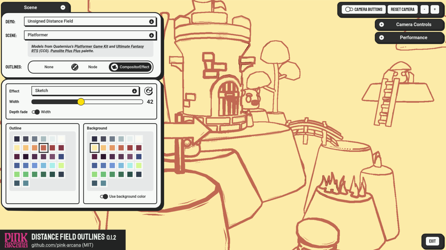
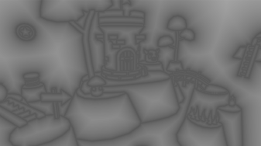
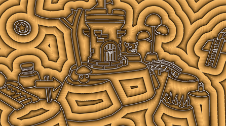
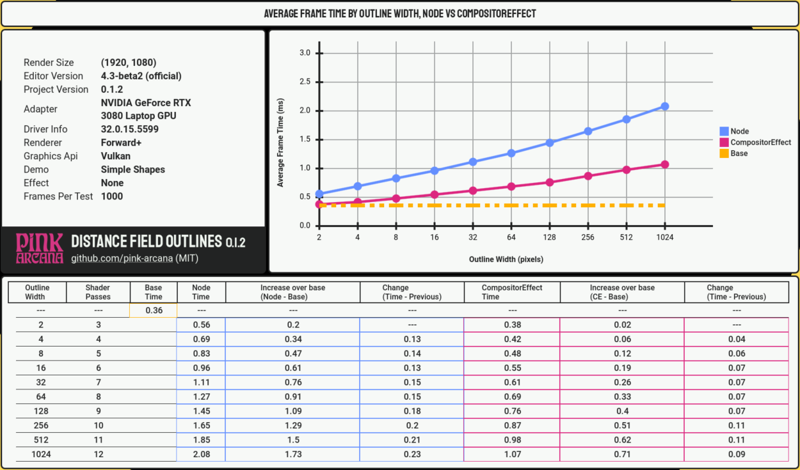
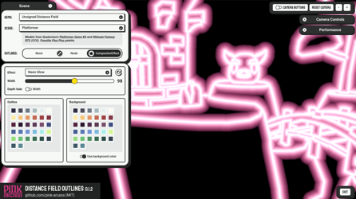
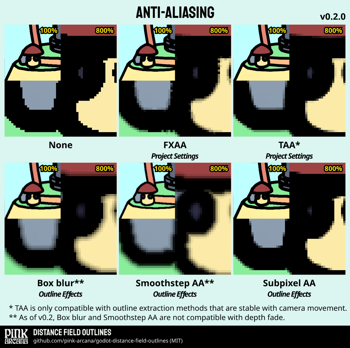

# Distance Field Outlines

This Godot 4.3 demo project uses **distance fields** to create **wide and performant post-process outlines**. It has two separate versions of the same algorithm: **a node (***DFOutlineNode***) for Compatibility mode**, and **a CompositorEffect (***DFOutlineCE***) for Forward+**. They are MIT-licensed and available for anyone to use in their own project.

*See the [LICENSE](LICENSE) for information and licenses for all included assets.*

- [How to use this project](#how-to-use-this-project)
    - [Running the demo](#running-the-demo)
    - [Adding it to your own project](#adding-it-to-your-own-project)

- [How this project works](#how-this-project-works)
    - [Distance fields](#distance-fields)
    - [Shaders](#shaders)
    - [DFOutlineNode](#dfoutlinenode)
    - [DFOutlineCE](#dfoutlinece)
    - [Performance](#performance)
    - [Choosing between versions](#choosing-between-versions)

- [Settings](#settings)
    - [Outline width](#outline-width)
    - [Outline effects](#outline-effects)
    - [Anti-aliasing](#anti-aliasing)
    - [Depth fade](#depth-fade)
    - [Changing settings at runtime](#changing-settings-at-runtime)
    - [Animation](#animation)

------------------------------------------------

Discussions
- [Getting started with CompositorEffects and Compute shaders](https://github.com/pink-arcana/godot-distance-field-outlines/discussions/1)
- [Performance and optimizations](https://github.com/pink-arcana/godot-distance-field-outlines/discussions/5)
- [Other Godot distance field projects](https://github.com/pink-arcana/godot-distance-field-outlines/discussions/6)

------------------------------------------------

## How to use this project

### Running the demo

Web:
**Run the [web version of this demo on Itch.io](https://pink-arcana.itch.io/distance-field-outlines).**
- It is a single-threaded web export and works on touchscreens, but the UI is intended for larger screens.
- The CompositorEffect and performance benchmarking are disabled.

Desktop:
- Clone this repository, or, from [the main Github page](https://github.com/pink-arcana/godot-distance-field-outlines), click on `<Code>` and select `Download ZIP`.
- Open the project in [Godot 4.3 beta](https://godotengine.org/download/preview/) or later.
    - The first time you open the project, you may see multiple errors. This is because the cache hasn't been created. Save the project, then open the `Project` menu and select `Reload Current Project`. This time, it should open without errors.
- Click on `Run Project`.

### Adding it to your own project
- Choose which version you want to use (see below).
- Follow the instructions in the [***DFOutlineNode*** README](project/df_outline_node/README.md) or [***DFOutlineCE*** README](project/df_outline_ce/README.md) to add it to your project.

------------------------------------------------

## How this project works
### Distance fields

*A distance field generated by this demo (lightened for readability). And the same distance field, visualized as steps.*

Distance fields are textures that tell you how far you are from a particular point of interest. Unsigned distance fields give you the distance only. Signed distance fields (SDF) also give you a concept of inside or outside, based on whether the distance value is positive or negative.

Valve popularized the use of distance fields in games in [this 2007 paper](https://steamcdn-a.akamaihd.net/apps/valve/2007/SIGGRAPH2007_AlphaTestedMagnification.pdf), and you can find them everywhere now ([many links here](https://github.com/CedricGuillemet/SDF)). Godot uses distance fields to render fonts ([MSDF](https://docs.godotengine.org/en/stable/tutorials/ui/gui_using_fonts.html)) and for global illumination ([SDFGI](https://docs.godotengine.org/en/stable/tutorials/3d/global_illumination/using_sdfgi.html)). Unreal creates [mesh distance fields](https://dev.epicgames.com/documentation/en-us/unreal-engine/mesh-distance-fields-in-unreal-engine) for objects. And games like [Manifold Garden](https://www.youtube.com/watch?v=5VozHerlOQw) use SDF for their endlessly sharp architecture.

Distance fields are neat for a few reasons:
- They're sharp and accurate, and scale with vector-like quality.
- They're inherently performative.
- They give you data you can use to create lots of different effects.

Distance fields can be in multiple dimensions, including 2D or 3D. They can be [generated procedurally](https://iquilezles.org/articles/distfunctions/) using mathmatical functions, or from a static image by measuring the distance at each pixel.

This project uses **unsigned distance fields** to render post-process outlines. I used [The Quest for Very Wide Outlines](https://bgolus.medium.com/the-quest-for-very-wide-outlines-ba82ed442cd9) by Ben Golus as a foundation, along with math from [demofox](https://blog.demofox.org/2016/02/29/fast-voronoi-diagrams-and-distance-dield-textures-on-the-gpu-with-the-jump-flooding-algorithm/). Every frame, it takes the current viewport image and uses the [jump flooding algorithm](https://en.wikipedia.org/wiki/Jump_flooding_algorithm) in a series of shader passes to create a distance field. The outlines it renders are the kind you can get from other post-process outline shaders, just wider, and with more opportunities for special effects.

### Shaders
Both versions are made up of three shaders:
- **Extraction shader**: Finds the outline's location and converts it into a seed for the jump flooding passes. For simplicity, this project uses a basic color-based algorithm to find edges.
    - You can adapt this shader to use the outline algorithm that works best for your project. You can use methods like depth and normals, object IDs, or a custom buffer for internal lines. Panthavma's [Line Rendering Deep Overview: Part 1 - Extraction](https://panthavma.com/articles/lines/deep-overview-extraction/) can help you figure out what kind you need. And [Godot shaders](https://godotshaders.com/) has examples for many different options.
        - In a normal post-process outline shader, you will have logic to determine if a particular texel should be part of the outline. This is the same here. The difference is that, normally, you would then set the output image color to the outline color. Here, you will store the texel's own coordinates as a color.

- **Jump flooding pass shader**: Runs a dynamic number of times to create a distance field large enough for the target outline width.

- **Overlay shader**: Renders the distance field as an outline, with optional special effects and depth fade.
    - You can swap out this shader with your own rendering effects or anti-aliasing. [Shadertoy](https://www.shadertoy.com) has many examples.

### DFOutlineNode
***DFOutlineNode*** is a Node that you can add to any 3D scene. It uses the post-processing method described in Godot's [Multi-pass post-processing tutorial](https://docs.godotengine.org/en/latest/tutorials/shaders/custom_postprocessing.html#multi-pass-post-processing) to dynamically add a stack of CanvasLayer nodes to the scene at runtime. Each CanvasLayer contains a ColorRect with a CanvasItem shader. Together, they function as a shader pass.

- Requirements
    - **Renderer:** Any, but optimized for Compatibility. Works in single- and multi-threaded web exports.
    - **Engine version:** Godot 4.3 beta or later (due to minor Godot 4.3 changes). However, can be adapted for earlier versions of Godot 4, or even Godot 3.
    - **Source:** Works out of the box with a 3D scene. Could work with a 2D scene with minor changes.
    - **Timing:** After the built-in rendering for the 3D scene is complete.
    - **Code:** GDScript and CanvasItem shaders. The GDScript is high level and focused on managing nodes in the SceneTree.

### DFOutlineCE
***DFOutlineCE*** is a [CompositorEffect](https://docs.godotengine.org/en/latest/classes/class_compositoreffect.html), a new Resource available in Godot 4.3 beta that you assign to a Camera3D or WorldEnvironment node. As described in [Compositor tutorial](https://docs.godotengine.org/en/latest/tutorials/rendering/compositor.html), it uses the low-level [RenderingDevice](https://docs.godotengine.org/en/latest/classes/class_renderingdevice.html) class to insert [Compute shader](https://docs.godotengine.org/en/latest/tutorials/shaders/compute_shaders.html) passes into the existing rendering pipeline.

- Requirements
    - **Renderer:** Forward+ only. Not tested on mobile, but likely incompatible due to hardware limitations on compute shaders.
    - **Engine version:** Godot 4.3 beta or later.
    - **Source:** A 3D scene. Could use workarounds for 2D, such as projecting a 2D SubViewport onto a 3D object.
    - **Timing:** Before or after a specific 3D rendering pass. The last time it can run is *before* built-in post-processing is complete -- after transparency, but before before tone-mapping, etc.
    - **Code:** GDScript and compute shaders (GLSL). GDScript uses [RenderingDevice](https://docs.godotengine.org/en/latest/classes/class_renderingdevice.html) methods to connect to the Vulkan API. If you are not already familiar with low-level graphics programming, there can be a steep learning curve. See more information in the discussions: [Getting started with CompositorEffects and Compute shaders](https://github.com/pink-arcana/godot-distance-field-outlines/discussions/1).

### Performance
*See the [Performance and optimizations](https://github.com/pink-arcana/godot-distance-field-outlines/discussions/5) discussion for ways to test performance, and ideas for optimizations.*

Distance fields in general tend to be performant. The distance data gives you enough information to create complex effects and animations without extra cost.

The jump flooding algorithm, which we are uses to create the distance fields, is also extremely efficient. See [The Quest for Very Wide Outlines](https://bgolus.medium.com/the-quest-for-very-wide-outlines-ba82ed442cd9) by Ben Golus for detailed comparisons of different algorithms.

Our unsigned distance field, which expands in two directions simultaneously, is also slightly more performant than a signed distance field that only expands in one direction. It requires distance fields that are half as wide. However, because JFA scales so efficiently, this only results in only one fewer shader pass.

What can make it slower:
- Larger screen size - more pixels to sample in each shader pass, and more JFA passes required for the same relative outline width.
- Larger outline width - more JFA passes needed to create the distance field.

The actual content on the screen, like how many objects there are, or how many outlines it needs to render, does *not* affect performance.

### Choosing between versions

In this project, both versions have similar visual quality, but only DFOutlineCE has depth fade feature.

***DFOutlineCE*** is significantly faster than ***DFOutlineNode***. But, depending on your project and the target hardware, performance may be good enough for both that it's not a deciding factor.

***DFOutlineCE*** has great potential for extension: it has all the data storage options that come with Compute shaders, and extra frame time to spare. With ***DFOutlineNode***, you can add extra inputs at the cost of rendering additional SubViewports, but it has limited storage between passes (see the [***DFOutlineNode*** README](project/df_outline_node/README.md) for details).

***DFOutlineNode*** also has inherent technical debt and breaks more easily. Managing its nodes in the scene tree requires careful attention to race conditions. And, because it's composed of CanvasItem nodes, changes to the Project's viewport settings will affect how it renders. ***DFOutlineCE***, with its direct connection to RenderingDevice, is more reliable.

------------------------------------------------

## Settings
***DFOutlineNode*** and ***DFOutlineCE*** both use the ***DFOutlineSettings*** resource for their settings. To change a value, open either object's inspector, then create or open the ***DFOutlineSettings*** resource.

*This screenshot shows the outline settings available in the demo. There are additional settings you can edit in the ***DFOutlineSettings*** resource.*

### Outline width
Choose both an outline width and a viewport size. The width is normalized to the size of the viewport, so that outlines will look the same when the viewport size changes.

### Outline effects

This demo comes with some basic effects, including an animation, to demonstrate different ways you can render the distance field.

### Anti-aliasing

The Smoothstep AA effect is based on the method described in [Valve's 2007 paper](https://steamcdn-a.akamaihd.net/apps/valve/2007/SIGGRAPH2007_AlphaTestedMagnification.pdf). The Subpixel AA effect uses the fractional difference between the outline width and the distance values. It is is based on [The Quest for Very Wide Outlines](https://bgolus.medium.com/the-quest-for-very-wide-outlines-ba82ed442cd9) by Ben Golus. See also: [Antialiasing for SDF Textures](https://drewcassidy.me/2020/06/26/sdf-antialiasing/).

### Depth fade (experimental)
Fading outlines for far-away depths can be important for scenes with wide outlines, so they don't obscure objects in the distance. DFOutlineCE has the ability to fade both width and transparency. Depth fade is not compatible with DFOutlineNode or with [outline effects](https://github.com/pink-arcana/godot-distance-field-outlines/issues/8).

### Changing settings at runtime
You can change values in ***DFOutlineSettings*** via script at runtime. ***DFOutlineNode*** or ***DFOutlineCE*** will automatically update for the next frame.

There is some overhead to changing settings. That overhead is greater in ***DFOutlineNode***, especially if a width change leads to a change in the number of jump flooding passes. This requires updating the scene tree, so ***DFOutlineNode*** has a timer to prevent too-frequent updates.

### Animation

[Link to a "Happy Pride" animation created using this project (Mastodon)](https://mastodon.gamedev.place/@pink_arcana/112666482495972950).

If you are using ***DFOutlineNode***, you can keyframe the attached ***DFOutlineSettings***' export variable values in the inspector.

However, as of Godot 4.3 beta 2, it seems you cannot directly keyframe values in CompositorEffects, so you need [a workaround using shared resources as described here](project/df_outline_ce/README.md#animating). Aside from this limitation, ***DFOutlineCE*** is a better choice for animations, as it requires much less overhead to change settings.

