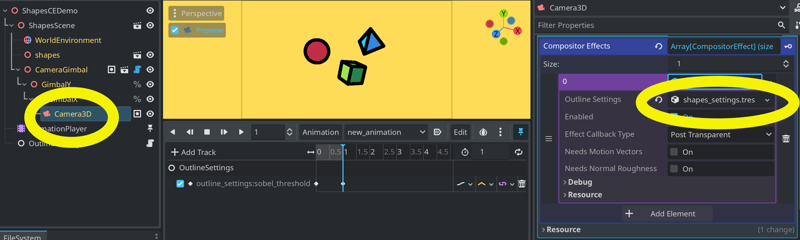
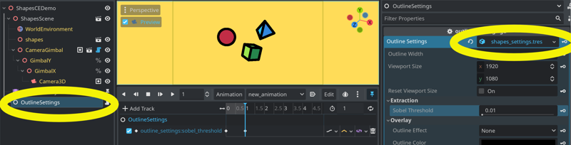

## Distance Field Outlines: DFOutlineCE

See the main Distance Field Outlines [README](https://github.com/pink-arcana/godot-distance-field-outlines) for an overview of how DFOutlineCE works and its requirements.

### Adding DFOutlineCE to your project
- Move the contents of the `df_outline_ce` and `shared_dependencies` folders to your project.
- Update the paths to the shaders at the top of `df_outline_ce.gd`.

### Adding DFOutlineCE to your scene
- Click on either your Camera3D or WorldEnvironment node to open its inspector.
- Find the Compositor section. If it is empty, use the drop-down menu to create a new compositor.
- Click on the Compositor resource to open it.
- Click on the `Array[CompositorEffect]` to expand it.
- Click the `Add Element` button.
- In the <empty> slot, press the drop-down menu and select `New DFOutlineCE`.
- Click on the new `DFOutlineCE` resource to expand it.
    - In `Effect Callback Type`, choose the 3D rendering stage when you want it to draw.
        - Depending on the stage you choose, checkboxes will appear to toggle additional buffers. You can ignore them. DFOutlineCE automatically sets the values it requires.
    - Click on or create `DFOutlineSettings` to open the settings. (See [Settings](https://github.com/pink-arcana/godot-distance-field-outlines#settings) in the main README.)

### Previewing in the editor

#### On a WorldEnvironment node
If you have DFOutlineCE on your WorldEnvironment node, it will automatically show in your main 3D editor viewport. Unfortunately, it also applies to grid lines and gizmos. Which editor elements are affected depends on the `Effect Callback Type`'s rendering stage.

- In the view menu, you can toggle the Origin and Grid off completely.
- To avoid the extra outlines while you are working, you may want to move DFOutlineCE to the Camera3D instead.

#### On a Camera3D
- Select the Camera3D in your scene tree.
- In the main 3D viewport, toggle the camera preview button.

### Animating
As of Godot 4.3 beta 2, it appears you can't directly keyframe any `@export` variables on a CompositorEffect. However, in this project, you can still animate its settings.

1. Save the CompositorEffect's `DFOutlineSettings` resource to disk.
2. Create a new Node in your scene tree with an `@export` variable like this: `@export var outline_settings : DFOutlineSettings`
3. Assign the same saved `DFOutlineSettings` resource to the Node you created. Do *not* make either instance of the resource unique.
4. Then keyframe the `DFOutlineSettings` resource from the Node. Because it is the same resource, when you play back the animation, it will animate `DFOutlineCE`.

*DFOutlineCE with a saved DFOutlineSettings resource assigned. Note that its @export variables do not have keyframe buttons.*
  

*The same DFOutlineSettings assigned to a separate Node in the scene tree. You are able to keyframe its variables from here.*